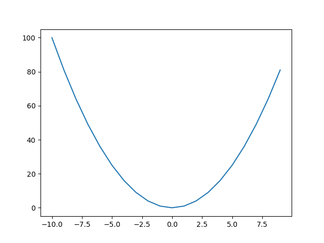
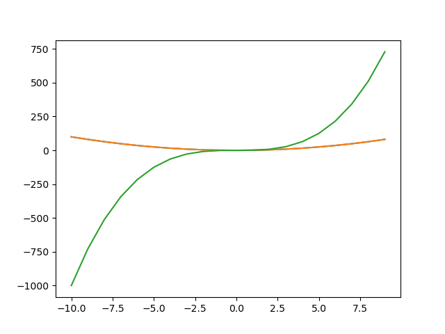

Plotting with Python
--------------------

Plotting is often done with the matplotlib library.

```python
import matplotlib.pyplot as plt
```

Note: in an interactive script, you would want to use plt.show() rather than plt.savefig().

Here is a simple example.

```python
plt.plot(range(-10, 10), [x**2 for x in range(-10, 10)])
plt.savefig("xsquared.png")
```


You can plot more than one curve on the same plot.

```python
plt.plot(range(-10, 10), [x**2 for x in range(-10, 10)])
plt.plot(range(-10, 10), [x**3 for x in range(-10, 10)])
plt.savefig("xsquared-and-cubed.png")
```

